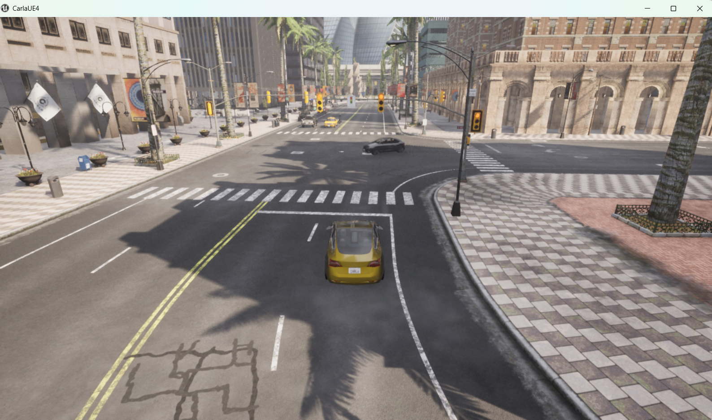
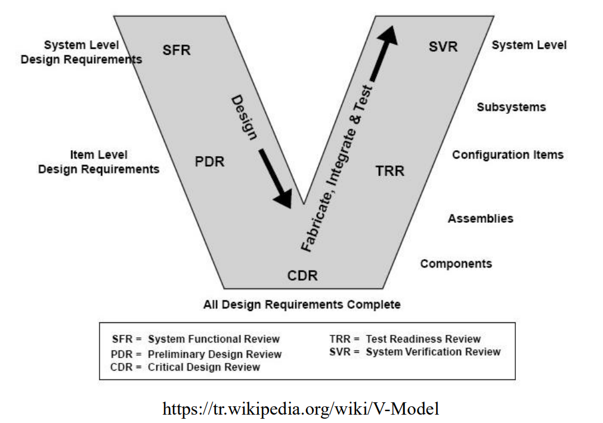
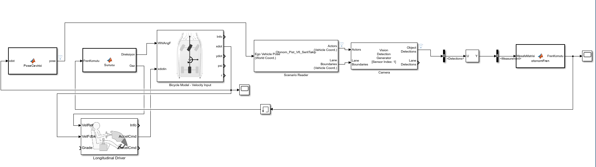
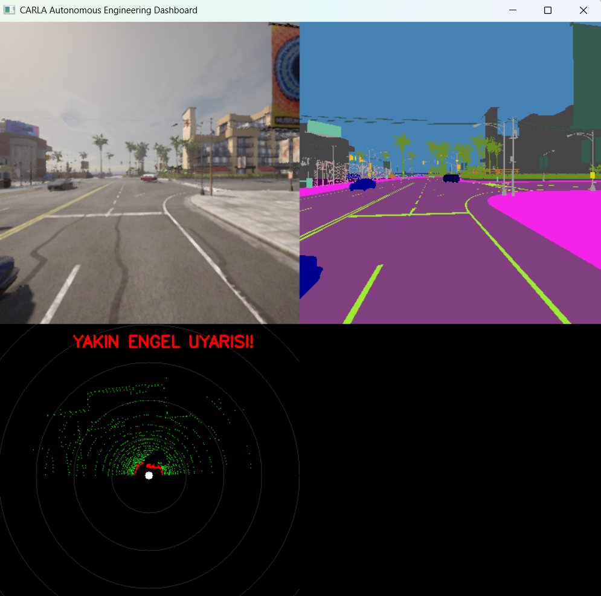
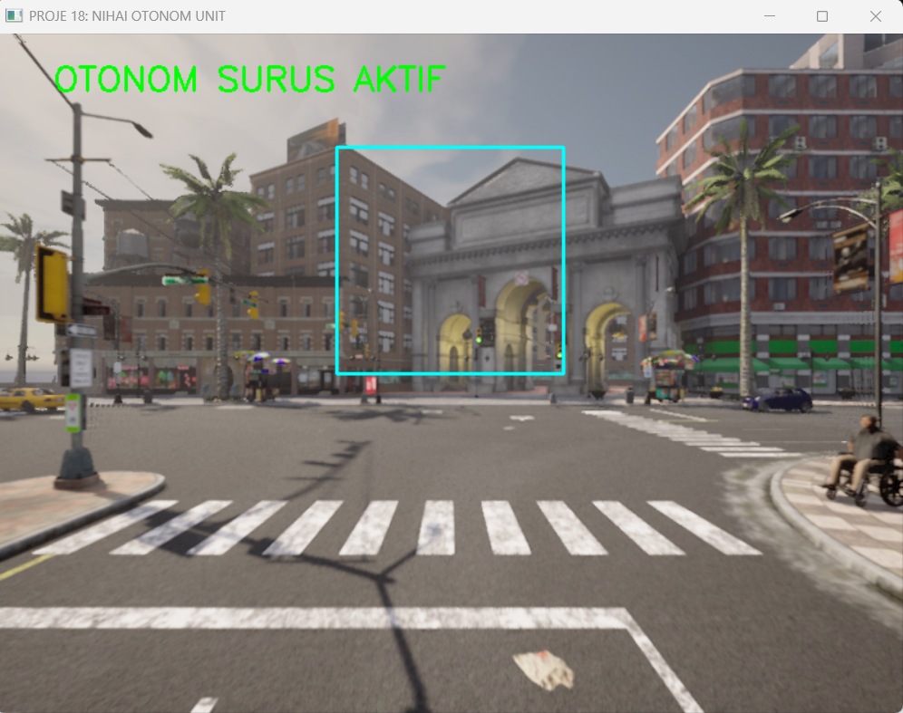
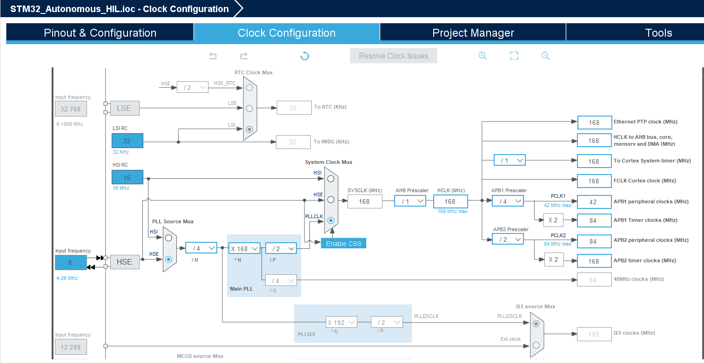
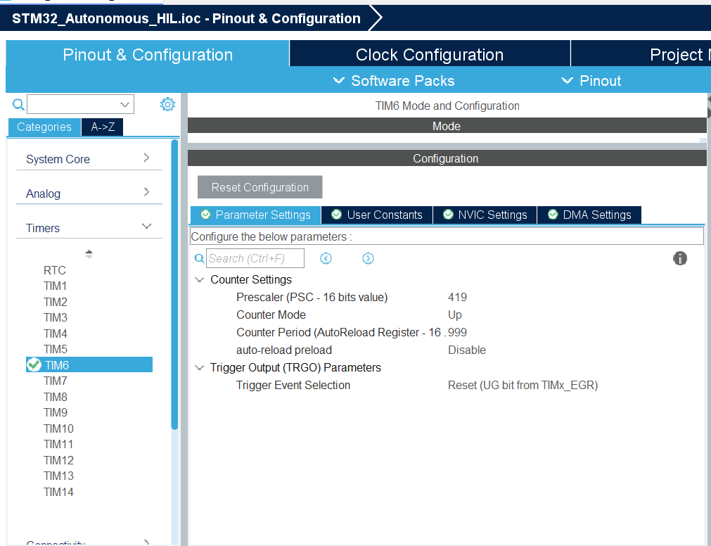

# 🚗 Autonomous Driving Ecosystem: From MBD to Real-Time HIL



This repository represents a comprehensive 3-phase journey in autonomous vehicle development, moving from mathematical modeling in **MATLAB/Simulink** to high-fidelity simulation in **CARLA** and final hardware deployment on **STM32**.

---

## 🏗 Project Architecture: The 3-Phase Evolution

The project follows the automotive **V-Model** development cycle, ensuring traceability from theoretical requirements to hardware verification.

---

### **Phase 1: Model-Based Development (MATLAB/Simulink)**

* **Focus:** Physics-based modeling of Lane Keeping Assist (LKA) and Autonomous Emergency Braking (AEB)
* **Safety Standard:** Designed with **ISO 26262** Functional Safety principles
* **Core Logic:** Closed-loop feedback systems and signal processing filters for sensor stability
* **Key Files:** `otonomFren.m`, `PoseCevirici.m`, `Surucu.m`



*Figure 1: High-level methodology and signal routing architecture.*

---

### **Phase 2: Perception & Algorithmic R&D (Python & CARLA)**

In this stage, the system transitions into a high-fidelity 3D environment using the CARLA Simulator.

* **Computer Vision:** Lane detection using Canny Edge and Hough Transform
* **Sensor Fusion:** LiDAR-based object detection and distance estimation
* **Automation:** 18 incremental projects (001–018) developing the perception stack



*Figure 2: Multi-sensor dashboard displaying Semantic Segmentation, LiDAR point clouds, and RGB feed.*

---

### **Phase 3: Hardware-in-the-Loop (STM32 Integration)**

The "Brain" of the vehicle is offloaded to an **STM32F4 Discovery** microcontroller, acting as a real-time Electronic Control Unit (ECU) communicating with CARLA via UART.

* **Control Theory:** Implementation of a PD (Proportional-Derivative) controller in C.
* **Timing:** Real-time 200Hz execution loop (5ms) for deterministic control response.
* **Reliability:** Hardware-level Watchdog and Fail-Safe logic for communication loss handling.



#### **ECU Hardware Configuration**
To ensure deterministic real-time performance, the STM32 is configured with a 168 MHz system clock and a dedicated timer for the control loop.




*Figure 3: Final HIL integration. Clock configuration at 168 MHz and TIM6 parameter setup for 200Hz control frequency.*


## 📂 Repository Structure

```text
.
├── assets/                  # Diagrams, Flowcharts, and Simulation Previews
├── scripts/                 # Utility scripts (Automation tools)
├── src/
│   ├── 01_MBD_Simulink/     # Phase 1: Models, Mat data, and M-scripts
│   └── 02_HIL_System/       # Phase 2 & 3: Real-time Implementation
│       ├── Python_Dev/      # R&D projects (001 to 018)
│       ├── Python_Bridge/   # Final 019_hil_bridge.py (SIM to ECU connector)
│       └── STM32_Firmware/  # C Source code, .ioc, and HAL drivers
└── README.md
```

---

## 🚀 Technical Guide & Workflow

### 1. Simulation Environment Setup

To run the CARLA environment with the Perception stack:

**Launch Simulator:**

```bash
CarlaUE4.exe
```

**Populate World (Terminal 1):**

```bash
python PythonAPI/examples/generate_traffic.py -n 50 -w 20
```

**Execute Development Scripts (Terminal 2):**

```bash
python src/02_HIL_System/Python_Dev/001_aeb_project.py
```

> ⚠️ Press `Ctrl + C` to stop a script before switching to another.

---

### 2. Dependencies

```bash
pip install carla opencv-python numpy pyserial
```

---

### 3. Running the HIL System (Phase 3)

**Flash Hardware**

* Use STM32CubeIDE to upload firmware to STM32F4

**Verify UART**

* Connect via USB
* Check COM Port in Device Manager

**Start Bridge**

```bash
python src/02_HIL_System/Python_Bridge/019_hil_bridge.py
```

---

## 📡 Protocol & Safety Features

The HIL Bridge uses a custom UART protocol at **115200 Baud**:

* **Downlink (PC → STM32):**
  8-byte packet (Header, Lane Error, Light Status, Obstacle Flags, Checksum)

* **Uplink (STM32 → PC):**
  10-byte packet (Header, Steer Cmd, Throttle Cmd, Checksum)

---

### 🛑 Fail-Safe Mechanism

* STM32 monitors communication heartbeat
* If no data for **250 ms**:

  * Emergency braking is triggered
  * System enters safe state
 